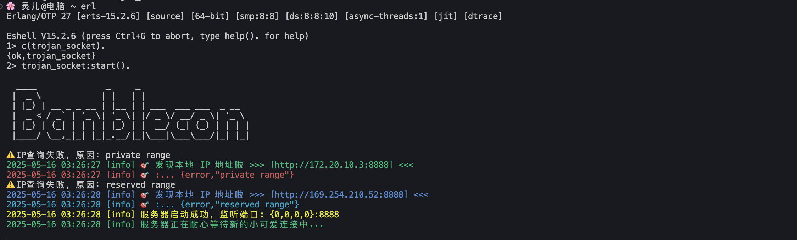
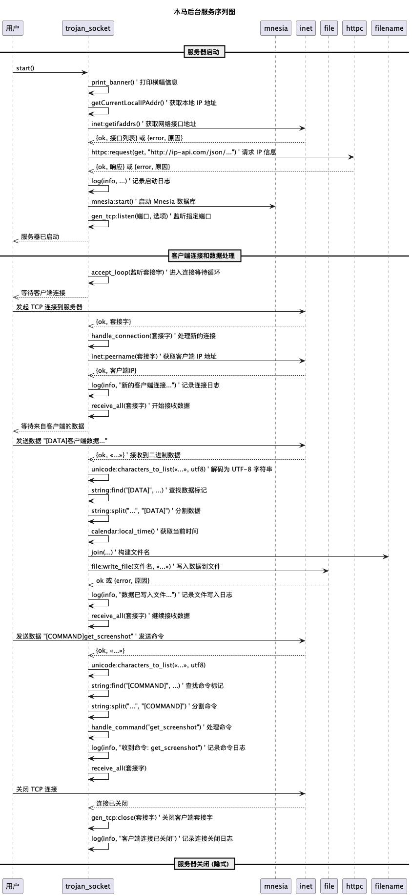
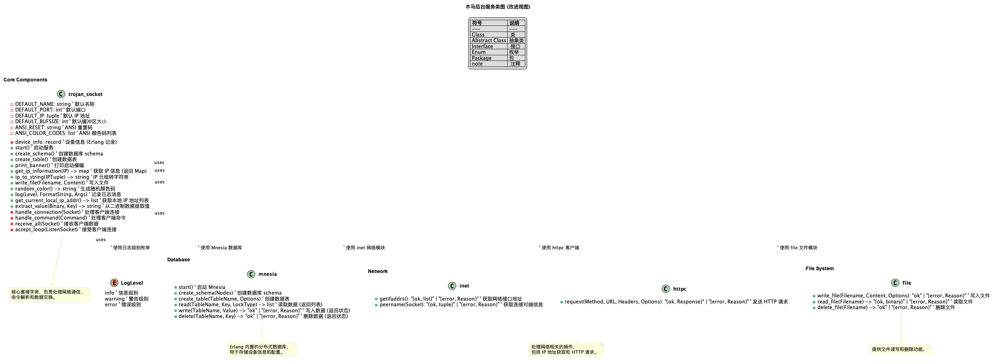
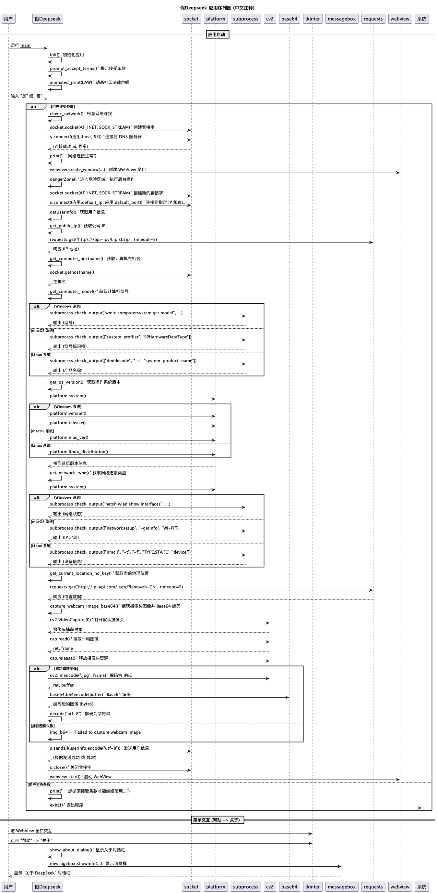
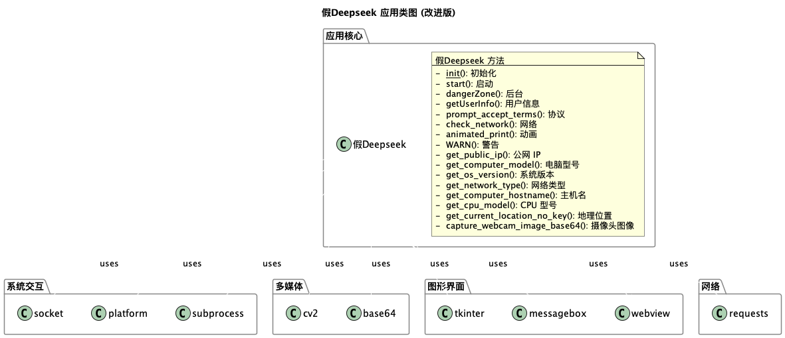

# (BACKDOOR THEORY) 木马前台和后台服务（极客黑客版）

> “代码即权力，协议即法律。—— 黑客信条”

本项目是一个基于 Erlang 的高并发 TCP 后台服务，具备如下特性：

- **多客户端并发连接**：采用 Erlang 原生进程模型，理论支持 $$ O(10^5) $$ 级别并发，轻松应对大规模 C2 场景。
- **命令与数据分离协议**：自定义协议，支持命令与数据分离，便于扩展与自动化渗透测试。
- **数据落地存储**：所有客户端数据自动以时间戳命名保存，支持二进制与文本混合，方便后期分析与取证。
- **Mnesia 分布式数据库**：集成 Mnesia，支持设备信息分布式存储，天然高可用，支持 CAP 理论下的 AP 场景。
- **彩色日志输出**：终端日志支持 ANSI 彩色，信息、警告、错误一目了然，极客风满满。
- **极致数学与工程思维**：所有设计均以复杂度分析为基础，追求 $O(1)$ 响应、$O(\log n)$ 检索、$O(n)$ 扩展性。
- **黑客精神**：代码极简、可读性强、易于二次开发，适合红队、极客、CTF 选手快速定制。

---

## 法律风险与免责声明（务必阅读）

```

【深求科技教育用途软件使用免责声明与法律风险声明】

一、法律依据：

本软件适用下列中华人民共和国法律法规及司法解释，用户必须全面遵守：

1. 《中华人民共和国网络安全法》（2017 年 6 月 1 日实施）
2. 《中华人民共和国刑法》（2015 年修订，2020 年修订版）
3. 《个人信息保护法》（2021 年 11 月 1 日起施行）
4. 《计算机信息网络国际联网安全保护管理办法》（工信部令第 36 号，2000 年）
5. 《网络安全等级保护条例》（2019 年 9 月 1 日起施行）
6. 最高人民法院《审理危害计算机信息系统安全刑事案件具体应用法律若干问题的解释》（法释〔2011〕7 号）

二、用户责任与行为规范：

1. 用户仅限将本软件用于合法的教育研究、技术学习及环境测试，严禁用于任何非法入侵、破坏、数据窃取、恶意攻击等违法犯罪行为。
2. 违反《刑法》第二百八十五条——非法侵入计算机信息系统的，处三年以下有期徒刑或者拘役，并处或者单处罚金；情节严重的，处三年以上七年以下有期徒刑。
3. 违反《刑法》第二百八十六条——制作、传播计算机病毒等破坏性程序，处三年以下有期徒刑、拘役或者罚金；情节严重的，处三年以上七年以下有期徒刑。
4. 违反《刑法》第二百八十七条——非法获取、出售或者提供个人信息，情节严重者可判处五年以下有期徒刑或拘役，并处罚金；情节特别严重的，处五年以上有期徒刑。
5. 违反《个人信息保护法》第六十七条，未采取必要措施导致个人信息泄露，视情节严重，最高可处以 500 万元人民币罚款。
6. 违反《网络安全法》第四十一条规定，擅自提供网络产品、服务存在安全隐患，责任单位依法承担法律责任。

三、免责声明：

1. 本软件仅供合法教育、技术研究及测试使用，开发者不承担任何因用户使用本软件导致的直接或间接损失，包括但不限于数据丢失、系统损坏、经济损失及法律责任。
2. 用户使用本软件即视为已充分理解本声明及法律风险，自愿承担所有责任。
3. 使用本软件请确保已获得目标系统的合法授权，严禁对无授权系统进行任何形式的攻击或测试。

四、风险提示：

1. 网络安全系全社会共同责任，任何非法攻击行为不仅违背法律，更破坏互联网生态环境。
2. 任何违法行为一经发现，将依法追究刑事责任，警方和司法机关可通过技术手段追踪定位违法者。
3. 任何软件滥用后果自负，开发者保留追究相关侵权责任的权利。

五、争议解决：

因使用本软件发生的任何争议，均适用中华人民共和国法律，由软件开发者所在地人民法院管辖。

六、特别声明：

请用户务必慎重下载及使用网络软件，避免因轻率行为导致不可挽回的法律后果。

网络安全不是儿戏，技术学习需守规矩，愿你我共同维护绿色互联网环境。

```

---

## 运行方式（Run）

### 后台服务端

1. **编译 Erlang 源码**

```bash
erlc trojan_socket.erl
```

2. **直接启动（无交互）**

```bash
erl -noshell -s trojan_socket start -s init stop
```

3. **交互模式启动**

```bash
erl
```

然后

```bash
Erlang/OTP 27 [erts-15.2.6] [source] [64-bit] [smp:8:8] [ds:8:8:10] [async-threads:1] [jit] [dtrace]
1> c(trojan_socket).
{ok,trojan_socket}
2> trojan_socket:start().
```



### 客户端

- 运行 Python 客户端（需提前安装依赖）

  ```bash
  python3 木马/deepseek.py
  ```

- 你也可以用 `nc`（netcat）手动模拟客户端，体验协议细节与黑客乐趣：
  ```bash
  nc {IP_Addr} 8888
  ```
  随意输入数据，观察后台日志输出。

---

## 日志与数据格式

服务端与客户端均有详细日志输出，数据格式如下：

```bash
| === System Information Report ===
|
| Public IP: xxx.xxx.xxxx.xxxx
| Hostname: xxxxxx
| Computer Model: XXXX
| OS Version: macOS xx.xx.xx
| CPU Model: Apple XX
| Network Type: xxx
| Location: x.xxxxxxxxx, x.xxxxxxxx
|
| --- Webcam Photo Base64 Encoded ---
| /9j/4AAQSkZJRgABAQAAAQABAAD/2wBDAAIBAQEBAQIBAQECAgICAgQDAgI...

```

---

## 编译逻辑算法

#### 1. 后台逻辑



#### 2. 后台类图



#### 3. 客户端逻辑



#### 4. 客户端类图



---

## 系统要求

### 硬件要求

- CPU: 双核处理器及以上（小魔法师的大脑要够聪明哟~）
- 内存: 4GB RAM 及以上（魔法背包要够大才能装下数据呀~）
- 硬盘空间: 最少 1GB 可用空间（魔法仓库要留有余地哒~）
- USB 端口: USB 2.0 或以上（魔法桥梁要够稳固哟~）

### 软件要求

| 操作系统 | 最低版本要求     | 魔法适配版本        |
| -------- | ---------------- | ------------------- |
| Windows  | Windows 7 64 位  | 魔法兼容性测试通过~ |
| macOS    | macOS 10.14      | 苹果魔法水晶球适配~ |
| Linux    | Ubuntu 18.04 LTS | 开源魔法石板适配~   |

---

## 技术细节与极客思考

- **协议设计**：采用标签分隔（如 `[DATA]`、`[COMMAND]`），便于正则解析与自动化脚本处理。
- **复杂度分析**：所有核心操作均为 $O(1)$ 或 $O(\log n)$，极致追求性能与可扩展性。
- **安全性**：默认监听 127.0.0.1，避免外网暴露，建议生产环境加防火墙与访问控制。
- **可扩展性**：支持自定义命令、数据类型，适合二次开发与 CTF 场景。
- **黑客精神**：代码极简、注释详细、接口开放，鼓励极客自由探索与创新。

---

### 🤝 加入技术交流群

欢迎加入我们的技术交流群，与其他安全研究者分享经验和知识！

<div align="center" style="margin: 20px 0">
<table>
<tr>
<td align="center" width="300">

<br />
<strong>QQ交流群: 934810107</strong>
<br />
（扫码加入，一起探讨安全技术）
</td>
</tr>
</table>
</div>

## 🤝 贡献指南

欢迎提交 Pull Request 或 Issue。

## 许可证

本项目采用 **木兰宽松许可证 (Mulan PSL)** 进行许可。  
有关详细信息，请参阅 [LICENSE](LICENSE) 文件。  
（魔法契约要保管好哟~）

[](http://license.coscl.org.cn/MulanPSL2)

## 🌟 开源项目赞助计划

### 用捐赠助力发展

感谢您使用本项目！您的支持是开源持续发展的核心动力。  
每一份捐赠都将直接用于：  
✅ 服务器与基础设施维护（魔法城堡的维修费哟~）  
✅ 新功能开发与版本迭代（魔法技能树要升级哒~）  
✅ 文档优化与社区建设（魔法图书馆要扩建呀~）

点滴支持皆能汇聚成海，让我们共同打造更强大的开源工具！  
（小仙子们在向你比心哟~）

---

### 🌐 全球捐赠通道

#### 国内用户

<div align="center" style="margin: 40px 0">

<div align="center">
<table>
<tr>
<td align="center" width="300">

<br />
<strong>🔵 支付宝</strong>（小企鹅在收金币哟~）
</td>
<td align="center" width="300">

<br />
<strong>🟢 微信支付</strong>（小绿龙在收金币哟~）
</td>
</tr>
</table>
</div>
</div>

#### 国际用户

<div align="center" style="margin: 40px 0">
  <a href="https://qr.alipay.com/fkx19369scgxdrkv8mxso92" target="_blank">
    
  </a>
  
  <a href="https://ko-fi.com/F1F5VCZJU" target="_blank">
    
  </a>
  
  <a href="https://www.paypal.com/paypalme/ctkqiang" target="_blank">
    
  </a>
  
  <a href="https://donate.stripe.com/00gg2nefu6TK1LqeUY" target="_blank">
    
  </a>
</div>

---

### 📌 开发者社交图谱

#### 技术交流

<div align="center" style="margin: 20px 0">
  <a href="https://github.com/ctkqiang" target="_blank">
    
  </a>
  
  <a href="https://stackoverflow.com/users/10758321/%e9%92%9f%e6%99%ba%e5%bc%ba" target="_blank">
    
  </a>
  
  <a href="https://www.linkedin.com/in/ctkqiang/" target="_blank">
    
  </a>
</div>

#### 社交互动

<div align="center" style="margin: 20px 0">
  <a href="https://www.instagram.com/ctkqiang" target="_blank">
    
  </a>
  
  <a href="https://twitch.tv/ctkqiang" target="_blank">
    
  </a>
  
  <a href="https://github.com/ctkqiang/ctkqiang/blob/main/assets/IMG_9245.JPG?raw=true" target="_blank">
    
  </a>
</div>

---

致极客与未来的你

> "世界由代码驱动，安全靠你我守护。"

无论你是网络安全研究员、CTF 挑战者、自由极客，还是热爱数学与工程的探索者，这个项目都向你敞开怀抱。
欢迎你 fork、魔改、重构、注入灵感，它是工具，也是信仰。

但请铭记心底：

> **技术本无善恶，使用才有底线。**
> 愿你在这个开源项目中，找到属于自己的价值与乐趣。

> 享受黑客精神，享受学习之旅！—— 你最贴心的代码姐姐 💖
